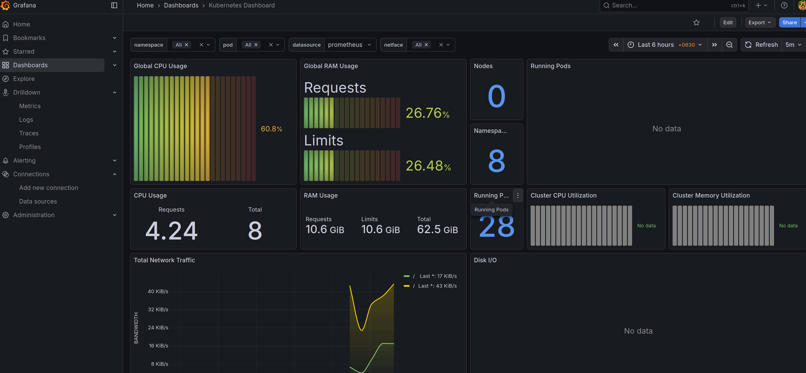
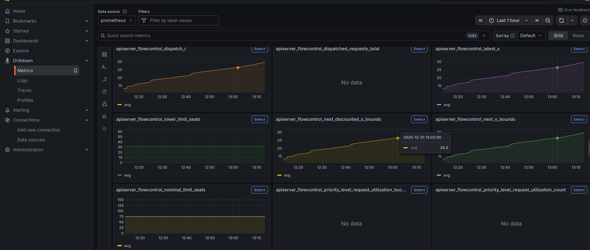
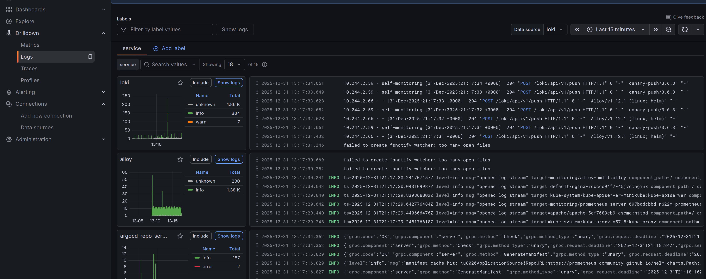
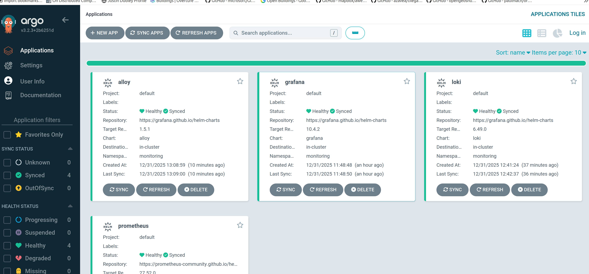

# k8s-cluster
Manifests and Tooling for a Kubernetes cluster (Minikube mostly)


## Resources:
Prometheus  
Grafana   
Loki  
Alloy


## Overview
Provisions basic monitoring (metrics, logs) for a local Kubernetes cluster:







## Argo 

### ArgoCD Installation (Core)
```
kubectl create namespace argocd  
kubectl apply -n argocd -f https://raw.githubusercontent.com/argoproj/argo-cd/v3.2.3/manifests/core-install.yaml
```

### Dashboard
argocd admin dashboard -n argocd



## Flux

### Flux Installation
```helm install -n flux-system --create-namespace flux oci://ghcr.io/fluxcd-community/charts/flux2```


### Alloy ConfigMap
```kubectl create configmap --namespace monitoring alloy-config "--from-file=config.alloy=./config.alloy"```


